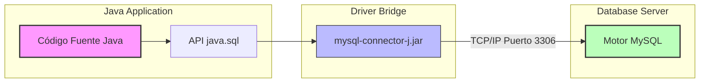

# 🧠 Documentación Técnica: Algoritmo JDBC (Java Database Connectivity)

Este documento detalla la fundamentación técnica y el flujo algorítmico implementado en el sistema **PAN DE CASA** para gestionar la comunicación bidireccional entre la aplicación de software desarrollada en **Java** y el motor de base de datos **MySQL**.

---

## 1. ¿Qué es JDBC y por qué es necesario?

**JDBC (Java Database Connectivity)** es una interfaz de programación de aplicaciones (API) estándar de Java SE que define cómo un cliente de software puede acceder de forma homogénea a cualquier base de datos relacional. 

JDBC funciona bajo un patrón de abstracción:
1. **API JDBC (`java.sql`)**: Define clases e interfaces abstractas independientes de la base de datos (ej. `Connection`, `PreparedStatement`, `ResultSet`).
2. **Controlador JDBC (Driver)**: Es el software puente desarrollado por el fabricante de la base de datos (en este caso, MySQL con `mysql-connector-j-9.0.0.jar`). Este conector traduce las llamadas a métodos genéricos de Java en tramas y comandos nativos del protocolo de comunicación por red TCP/IP de MySQL.



---

## 2. El Flujo Algorítmico del Ciclo de Vida JDBC

La persistencia de datos a través de JDBC sigue un patrón secuencial estricto estructurado en seis fases indispensables:

```
[1. Configuración] ➔ [2. Conexión] ➔ [3. Preparación] ➔ [4. Ejecución] ➔ [5. Mapeo/Lectura] ➔ [6. Liberación]
```

### Paso 1: Carga de Configuración Externa (Desacoplamiento)
Para no escribir contraseñas ni rutas de red directamente en el código de forma estática (lo cual es una falla grave de seguridad y flexibilidad), la configuración se lee de manera dinámica desde el archivo externo `db.properties` mediante la clase `java.util.Properties`:

```java
Properties prop = new Properties();
try (FileInputStream fis = new FileInputStream("db.properties")) {
    prop.load(fis);
    dbUrl = prop.getProperty("db.url");
    dbUser = prop.getProperty("db.user");
    dbPassword = prop.getProperty("db.password");
} catch (IOException e) {
    // Valores de contingencia por defecto si el archivo no existe
    dbUrl = "jdbc:mysql://localhost:3306/PAN_DE_CASA?useSSL=false";
    dbUser = "root";
    dbPassword = "";
}
```

### Paso 2: Establecer el Canal de Conexión (`Connection`)
Se solicita un túnel de comunicación con la base de datos al administrador de drivers (`DriverManager`), el cual busca el driver adecuado según el prefijo del protocolo en la URL (`jdbc:mysql://`):

```java
Connection conn = DriverManager.getConnection(dbUrl, dbUser, dbPassword);
```

### Paso 3: Preparación de la Sentencia SQL (`PreparedStatement`)
Para interactuar con los datos (crear, buscar, eliminar), el sistema utiliza de manera exclusiva `PreparedStatement`. A diferencia del `Statement` tradicional, esta clase permite el uso de parámetros dinámicos (`?`):

```java
String sqlInsert = "INSERT INTO cliente (IdNit, Nombre, Apellido, Direccion, Correo, Celular) VALUES (?, ?, ?, ?, ?, ?)";
PreparedStatement pstmt = conn.prepareStatement(sqlInsert);

// Asignación tipada de valores
pstmt.setLong(1, nit);          // Reemplaza el primer "?"
pstmt.setString(2, nombre);      // Reemplaza el segundo "?"
pstmt.setString(3, apellido);    // Reemplaza el tercer "?"
// ...
```

> [!IMPORTANT]
> **Beneficios Clave de `PreparedStatement`:**
> 1. **Prevención de Inyección SQL**: Los caracteres especiales en los parámetros son escapados de manera automática por el driver, evitando que código malicioso altere la estructura de la base de datos.
> 2. **Rendimiento mejorado**: El motor MySQL compila y optimiza el plan de ejecución de la consulta la primera vez, almacenándolo en caché para ejecuciones subsecuentes con diferentes valores de parámetros.

### Paso 4: Ejecución de la Consulta
Se selecciona el método adecuado en el driver según el tipo de operación SQL ejecutada:
* **Lectura (`SELECT`)**: Retorna un cursor apuntador con los registros solicitados.
  ```java
  ResultSet rs = stmt.executeQuery(sqlString);
  ```
* **Escritura / Borrado / Modificación (`INSERT`, `UPDATE`, `DELETE`)**: Retorna un entero que especifica cuántas filas fueron alteradas en las tablas.
  ```java
  int filasAfectadas = pstmt.executeUpdate();
  ```

### Paso 5: Mapeo Dinámico de Datos (`ResultSet` y `ResultSetMetaData`)
El procesamiento de los datos devueltos por una consulta de lectura se realiza iterando sobre un cursor `ResultSet`. En este proyecto, para poder mostrar consultas de forma dinámica en la interfaz gráfica (sin importar qué columnas o nombres retorne), se lee la estructura de la tabla (metadatos) utilizando `ResultSetMetaData`:

```java
ResultSetMetaData metaData = rs.getMetaData();
int columnCount = metaData.getColumnCount(); // Número total de columnas en la consulta

// 1. Obtener los nombres de columnas de forma dinámica
Vector<String> columnNames = new Vector<>();
for (int i = 1; i <= columnCount; i++) {
    columnNames.add(metaData.getColumnLabel(i));
}

// 2. Extraer los datos fila por fila
Vector<Vector<Object>> data = new Vector<>();
while (rs.next()) {
    Vector<Object> vector = new Vector<>();
    for (int i = 1; i <= columnCount; i++) {
        vector.add(rs.getObject(i)); // Lee el objeto nativo según la posición i de columna
    }
    data.add(vector);
}
```

### Paso 6: Liberación de Recursos y Cierre
Tanto los canales de red (`Connection`) como los cursores y búferes locales (`ResultSet`, `PreparedStatement`) ocupan memoria física tanto en el servidor MySQL como en la máquina cliente. Por tanto, es obligatorio cerrarlos en cuanto se termine su uso.

El proyecto implementa la estructura moderna **`Try-With-Resources`** de Java (disponible desde Java 7). Cualquier clase que implemente la interfaz `AutoCloseable` y que sea declarada dentro del bloque `try(...)` será cerrada de forma automática y segura por la Máquina Virtual de Java (JVM) al finalizar la ejecución, incluso si se lanzan errores o excepciones en el transcurso del proceso:

```java
// Declaración segura de recursos autocerrables
try (Connection conn = conectar();
     Statement stmt = conn.createStatement();
     ResultSet rs = stmt.executeQuery(sql)) {
     
     // El procesamiento ocurre aquí de manera segura...
     
} // Al llegar a esta llave final, la JVM invoca de forma implícita el método .close() de rs, stmt y conn.
```

---

## 3. Control de Excepciones e Integridad de Datos

Durante la comunicación con bases de datos pueden suceder fallas imprevistas. El sistema captura de manera especializada la clase `SQLException`:

```java
try (Connection conn = conectar()) {
    // Operación SQL...
} catch (SQLException e) {
    if (e.getErrorCode() == 1451) {
        // Código 1451: Restricción referencial (Foreign Key Constraint)
        JOptionPane.showMessageDialog(this, 
            "Error de Integridad: No se puede eliminar este registro porque está asociado a pedidos activos.", 
            "Error al eliminar", JOptionPane.ERROR_MESSAGE);
    } else {
        JOptionPane.showMessageDialog(this, 
            "Error General de Base de Datos: " + e.getMessage(), 
            "Error", JOptionPane.ERROR_MESSAGE);
    }
}
```

### Tabla de Códigos de Error MySQL Manejados
| Código SQL | Descripción Técnica | Solución del Sistema |
| :--- | :--- | :--- |
| **1451** | Restricción de Llave Foránea. Intento de eliminar un registro padre (ej. cliente) que contiene registros hijos asociados (ej. pedidos). | Intercepta el error e informa de manera amigable al usuario en lugar de colapsar la aplicación. |
| **1062** | Duplicidad de Llave Primaria (Duplicated Entry). Intento de registrar un NIT o código ya existente. | Alerta al usuario sobre la existencia previa del registro y evita la redundancia. |
| **08S01** / **08001** | Pérdida de comunicación o falla de enlace de red con el servidor de base de datos MySQL. | Actualiza la barra de estado inferior de la interfaz gráfica a color rojo informando: `"Estado: Error de conexión"`. |
